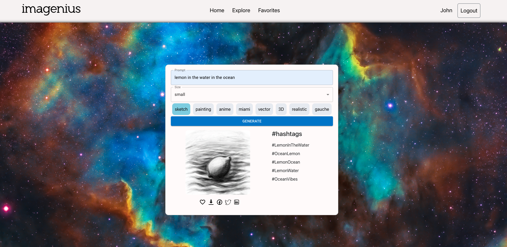
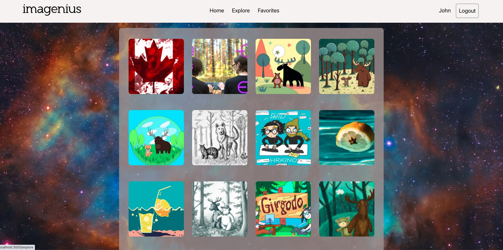
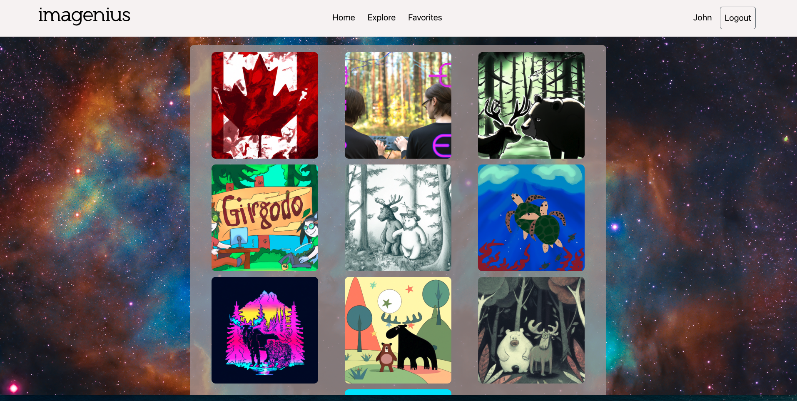

  <h2 align="center"><b>imagenius</b>imagenius</h2>

  <p align="center"> "Imagenius" is an impressive web application developed as the final project for a web development bootcamp.

## About The Project
<p>Imagenuis is an exceptional web application that combines the power of artificial intelligence to generate captivating images and creative hashtags. Designed as the culmination of a web development bootcamp, this innovative platform delivers an unparalleled user experience by harnessing the capabilities of AI. Users can access a vast collection of AI-generated images, ensuring a never-ending source of visual inspiration. Additionally, Imagenuis provides a unique feature of AI-generated hashtags, allowing users to effortlessly enhance their social media presence with engaging and relevant content. With its seamless functionality and cutting-edge technology, Imagenuis truly stands out as a remarkable achievement in the realm of web development.</p>

[]
[]
[]


### Built With


* [![React][React.js]][React-url]
* [![Bootstrap][Bootstrap.com]][Bootstrap-url]
* [![JQuery][JQuery.com]][JQuery-url]
* Expressjs
* Postgress


### Installation

Clone the application to your computer. 
1. Install NPM packages
   ```sh
   npm install
   ```
   For both folders /frontend and /backend.

2. Create your own .ENV file in the Backend folder. Generate API keys from this [https://openai.com/](https://openai.com/).
   <br />
 PORT = 8000
<br />

    OPENAI_API_KEY_IMAGE = 'ENTER YOUR API'
    <br />

    OPENAI_API_KEY_TEXT = 'ENTER YOUR API'
    <br />

    PGHOST=localhost
    PGUSER=labber
    PGDATABASE=final
    PGPASSWORD="labber"
    PGPORT=5432
<br />

3. Create a new database connection and run this commands:
<br />
   a. Run scheema \i db/schema/image_generator.sql
<br />
   b. Run seeds  \i db/seeds/01_images.sql


[React.js]: https://img.shields.io/badge/React-20232A?style=for-the-badge&logo=react&logoColor=61DAFB
[React-url]: https://reactjs.org/

[Bootstrap.com]: https://img.shields.io/badge/Bootstrap-563D7C?style=for-the-badge&logo=bootstrap&logoColor=white
[Bootstrap-url]: https://getbootstrap.com
[JQuery.com]: https://img.shields.io/badge/jQuery-0769AD?style=for-the-badge&logo=jquery&logoColor=white
[JQuery-url]: https://jquery.com 
